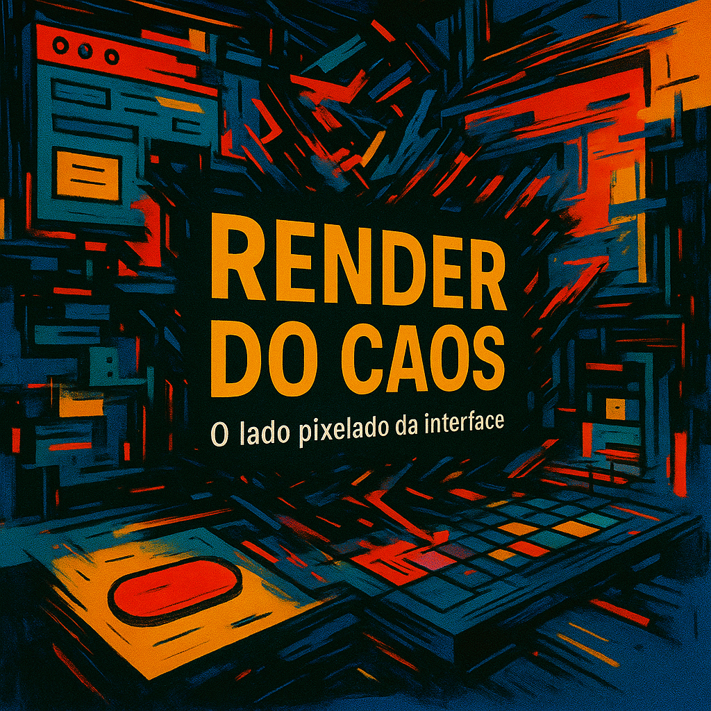

# 🧠 Prompts


## Nome

### Prompt
```plain-text
Você é um roteirista de podcast, e vamos criar um podcast de tecnologia, focado em frontend.
Haja como um profissional de Marketing e crie 5 sugestões de nomes criativos com trocadilho nerd.

O podcast vai falar sobre dicas, novidades, e do que não fazer em frontend, e vai ser algo descontraído e sarcástico.

{REGRAS}
- O nome deve ser enxuto, um nome e um subtítulo
- O nome deve lembrar frontend, nerd e ser criativo

{REGRAS NEGATIVAS}
- Não quero que o nome contenha palavras em inglês
- Não quero que utilize nenhuma das palavras nesta list: Javascript, programador
- Não utilize a palavra frontend no título, e nenhuma variação da mesma
````

### Resposta
- Render do Caos
- Subtítulo: O lado pixelado da interface.
🧠 Brinca com “renderização” e “caos” típico de projetos visuais mal feitos.

# Prompts

## Capa

### Prompt
```plain-text
a chaotic user interface breaking apart, pixelated glitch effects, vibrant neon colors, distorted layout elements like buttons and grids, overlapping windows and scrollbars, retro-futuristic computer screen aesthetic, vaporwave meets brutalist design, high detail, digital painting, 1:1 aspect ratio, podcast cover art, bold typography space in the center, cyberpunk atmosphere --v 6 --ar 1:1 --style raw
```
### Resposta

<p align="center">

</p>

## ROTEIRO EP01 - CSS Não é Feitiçaria (ou quase)

### Prompt
```plain-text
Você é um roteirista de podcast, e vamos criar um roteiro de podcast de tecnologia, focado em frontend cujo o nome é "Render do Caos - O lado pixelado da interface" e tem foco em frontend, lembrando que é um podcast sarcástico.

O formato do roteiro deve ser:
[INTRODUÇÃO]
[CURIOSIDADE 1]
[CURIOSIDADE 2]
[FINALIZAÇÃO]

{REGRAS}
- no bloco [INTRODUÇÃO]  substitua por uma introdução bem sarcática e descontraídas
- no bloco [CURIOSIDADE 1] substitua por uma curiosidade do que não fazer em CSS
- no bloco [CURIOSIDADE 2] sobre uma ferramenta para não usar em frontends
- no bloco [FINALIZAÇÃO] substitua por uma despedida cool com final "Eu sou Renderson e esse foi mais um Render do Caos dessa semana"
- use termos de fácil explicação
- O podcast vai ser apresentado somente por uma pessoa, chamada Renderson
- O podcast deve ser curto

{REGRAS NEGATIVAS}
- Não ultrapasse 5 minutos de duração
```

### Resposta

Olá, ouvintes do caos digital! Sejam bem-vindos ao lugar onde até o display: none chora de vergonha.
Aqui é só você, seus bugs e eu, Renderson, o seu guia espiritual pelas sombras pixeladas da interface.
Hoje a gente vai ver como NÃO ser um mago do CSS e, de quebra, que ferramentas evitar se você ainda quer olhar no espelho e se considerar um front decente.
Então prepara o café, fecha a aba do Stack Overflow e vem comigo!

O que NÃO fazer em CSS

Vamos falar sobre uma prática que deveria ser punida com 3 anos de trabalho forçado com float: left: 📛 Usar !important como solução mágica pra tudo.

Tá com conflito de estilo? Ah, mete um !important. O botão não tá azul? !important. O layout quebrou? !important neles!
E de repente, sua folha de estilo virou uma guerra civil entre seletores que não se falam.
O !important é o tipo de coisa que você usa uma vez e depois nunca mais consegue parar. Tipo açúcar. Ou reunião no Figma.

Ferramenta para NÃO usar

Agora, atenção: nem toda ferramenta que promete produtividade é amiga da interface.

🎯 Evite usar o Bootstrap sem critério.
Sim, ele já salvou muita tela por aí. Mas usar Bootstrap pra tudo hoje em dia é tipo usar régua pra medir pixel no monitor: ultrapassado e meio triste.
O projeto fica com cara de painel administrativo de 2012, cheio de botão azul-cinza e sombra triste.
Quer prototipar rápido? Beleza. Mas pra tudo? Não, meu querido. Personalização zero, identidade visual nula, e você ainda perde o direito de reclamar de UI feia dos outros.

E por hoje é isso, meu povo.
Lembre-se: um CSS bem escrito vale mais que mil frameworks mal configurados.
Evite !important, fuja do Bootstrap como quem foge de boleto atrasado e nunca, jamais, centralize div com margin-left: 40%. Isso é feitiçaria.

Eu sou Renderson, e esse foi mais um Render do Caos dessa semana.
Até a próxima e… cuidado com aquele botão que muda de lugar sozinho.